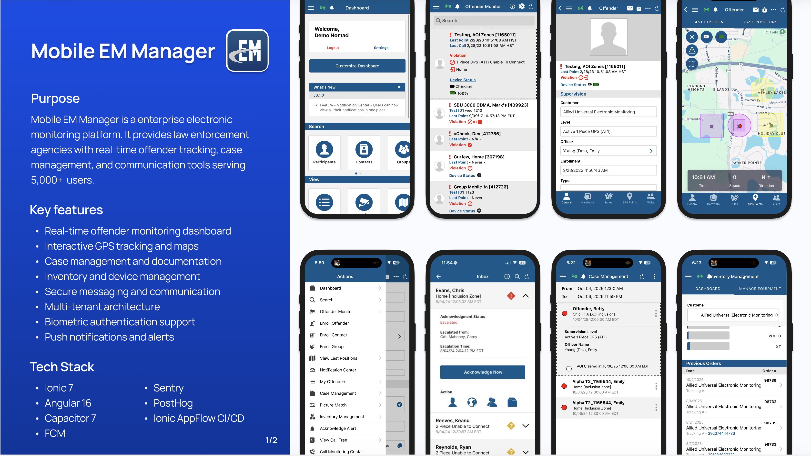
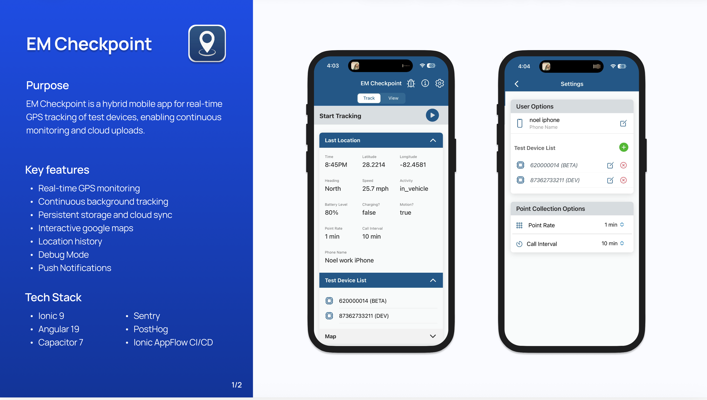
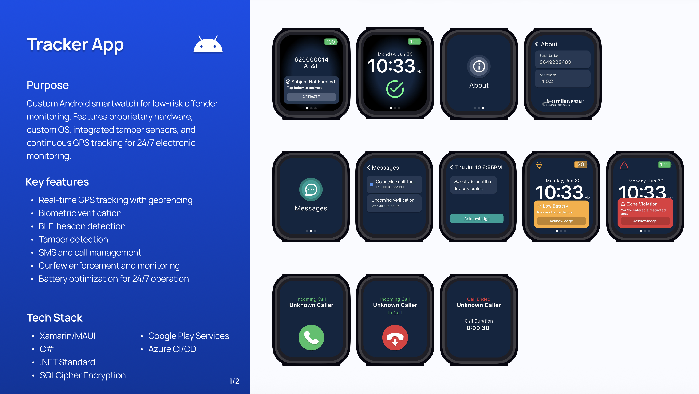
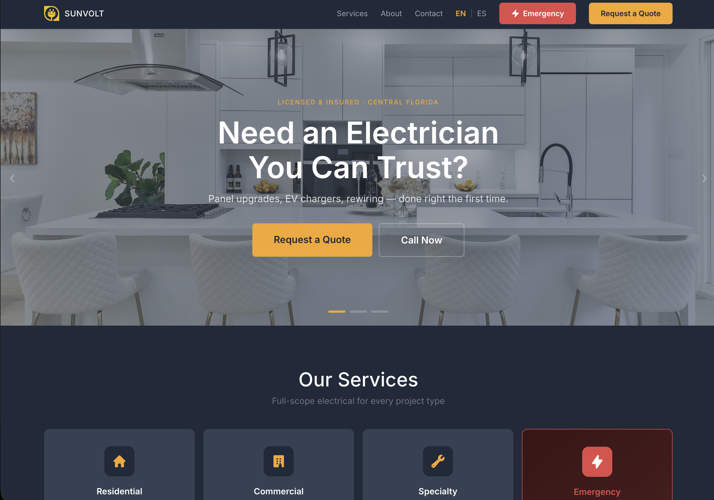
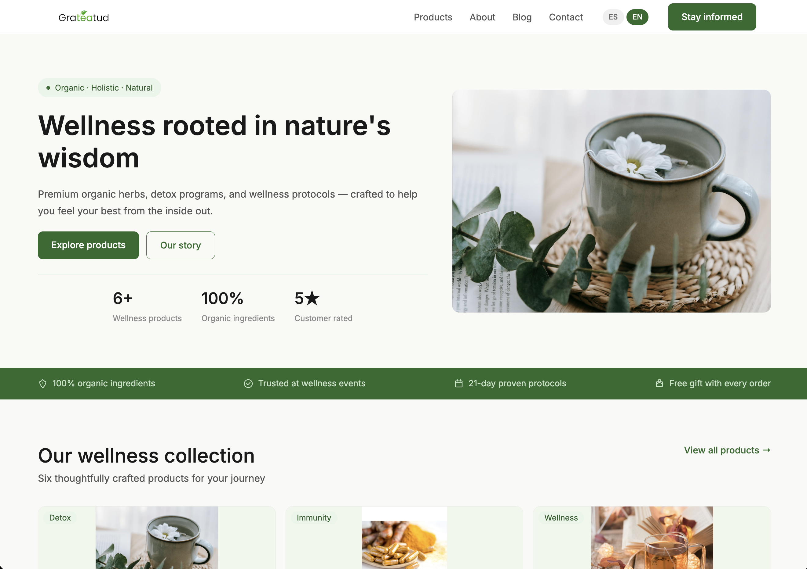

# Hi, I'm Noel Franceschi 👋

### Lead Mobile Developer — 9 years building mobile & web at enterprise scale

I lead mobile development for the US division at Allied Universal Electronic Monitoring, where I own the product roadmap and a cross-functional team spanning the US and UK. On the side I run **Franceschi Enterprises**, a software consultancy shipping production apps and sites for clients.

- 🛰️ Currently working on real-time GPS tracking and custom monitoring hardware
- 🌱 Currently learning **AI & RAG** — diving into LLM engineering
- 🛠️ I enjoy untangling complex technical challenges and building user-centric products
- 🎮 Outside of code: 3D printing, gardening, gaming, and the outdoors

---

### Languages

### Frameworks

### Tools

### Cloud, Data & DevOps

> **Primary mobile stack: Ionic + Capacitor.** Also working with Cordova, Xamarin/MAUI, StencilJS, Ionic AppFlow CI/CD, Sentry, PostHog, and Atlassian (Jira/Confluence).

---

## 💼 Enterprise Work

> Built at Allied Universal Electronic Monitoring. Screens below use demo data.

### Mobile EM Manager — Enterprise electronic monitoring platform

`Ionic 8` · `Angular 21` · `Capacitor 8` · `FCM` · `Sentry` · `PostHog` · `Ionic AppFlow CI/CD`

Real-time offender tracking, case management, and communication tools serving **5,000+ active users**. Modular Angular architecture with 7 feature modules and 60+ TypeScript services.

- Real-time monitoring dashboard with interactive GPS tracking and maps
- Case management, inventory/device management, and secure messaging
- Multi-tenant architecture with biometric authentication support
- Led the Ionic 4 → Ionic 8 migration that accelerated feature rollouts by **45%**

### EM Checkpoint — Real-time GPS tracking app

`Ionic 8` · `Angular 21` · `Capacitor 8` · `Azure` · `Google Maps` · `Sentry`

A hybrid mobile app for continuous, real-time GPS tracking of test devices with persistent storage and cloud sync.

- Continuous background tracking with location history
- Interactive Google Maps and configurable point/call intervals
- Reliable cloud synchronization with queue-based uploads

### Tracker App — Custom Android smartwatch for offender monitoring

`Xamarin/MAUI` · `C#` · `.NET Standard` · `SQLCipher` · `Google Play Services` · `Azure CI/CD`

Proprietary smartwatch hardware with a custom OS for 24/7 electronic monitoring — built on an MVVM architecture across 80+ XAML pages with encrypted local storage.

- Real-time GPS tracking with geofencing and zone-violation alerts
- Biometric verification, BLE beacon detection, and tamper detection
- SMS/call management and curfew enforcement, optimized for all-day battery

---

## 🚀 Independent & Client Work

> Built through Franceschi Enterprises.

### [aMind](https://amindapp.com/) — Mobile app

`Ionic` · `Angular` · `Capacitor`

Cross-platform mobile app currently in live in the [App Store](https://apps.apple.com/us/app/amind/id6759204607) and still in beta Android testing.

### [Cursos — Marianila Disruptiva](https://cursos.marianiladisruptiva.com/tabs/explore) — Online course platform

`Ionic` · `Angular` · `Capacitor`

A mobile-first single-page app for browsing and delivering online courses, built on the Ionic/Angular stack.

### [Sunvolt Electrical](https://sunvoltelectrical.com/) — Licensed electrician business site

`Astro` · `Responsive` · `Bilingual (EN/ES)`

Marketing and lead-generation site for a Central Florida electrical contractor — fast, fully responsive, and bilingual, with quote requests and click-to-call.

### [Grateatud](https://www.grateatud.com/en) — Organic wellness e-commerce

`Astro` · `Stripe` · `Bilingual (EN/ES)`

E-commerce storefront for organic herbal wellness products, featuring a product catalog, detox-program protocols, and Stripe checkout.

### [Sacred Readings](https://milecturasagrada.com/) — Stripe-powered reading service

`Astro` · `Stripe` · `Trilingual (EN/ES/PT)`

A booking and payment platform for personalized readings, with a multi-step request flow, three-language support, and secure Stripe payments.

---

### 📫 Get in touch

**LinkedIn:** [linkedin.com/in/noelfranceschi](https://linkedin.com/in/noelfranceschi)
